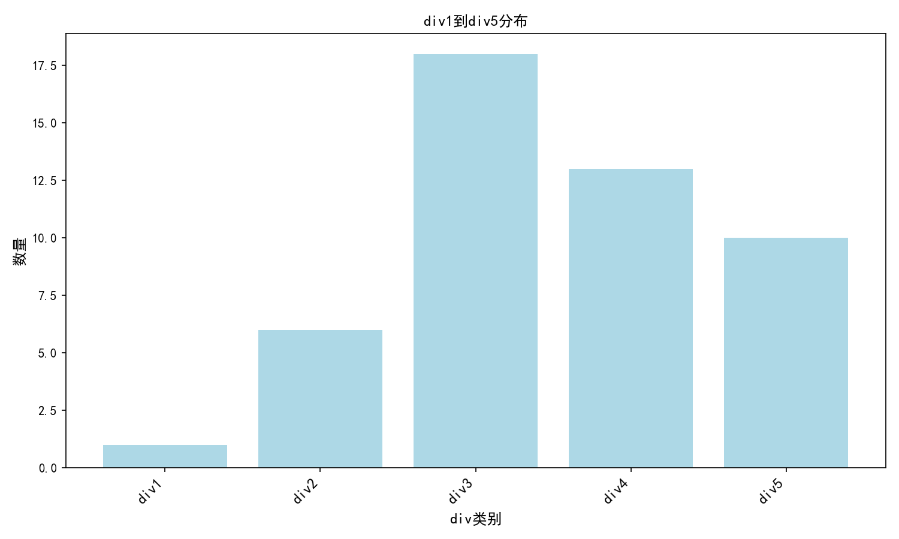
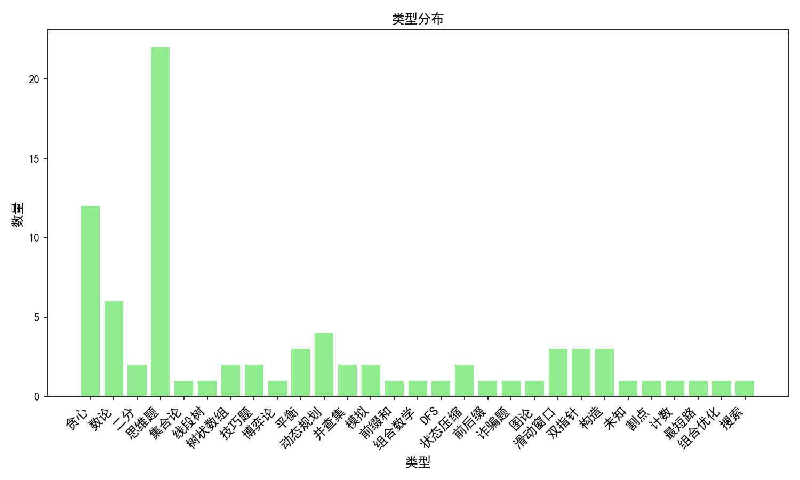
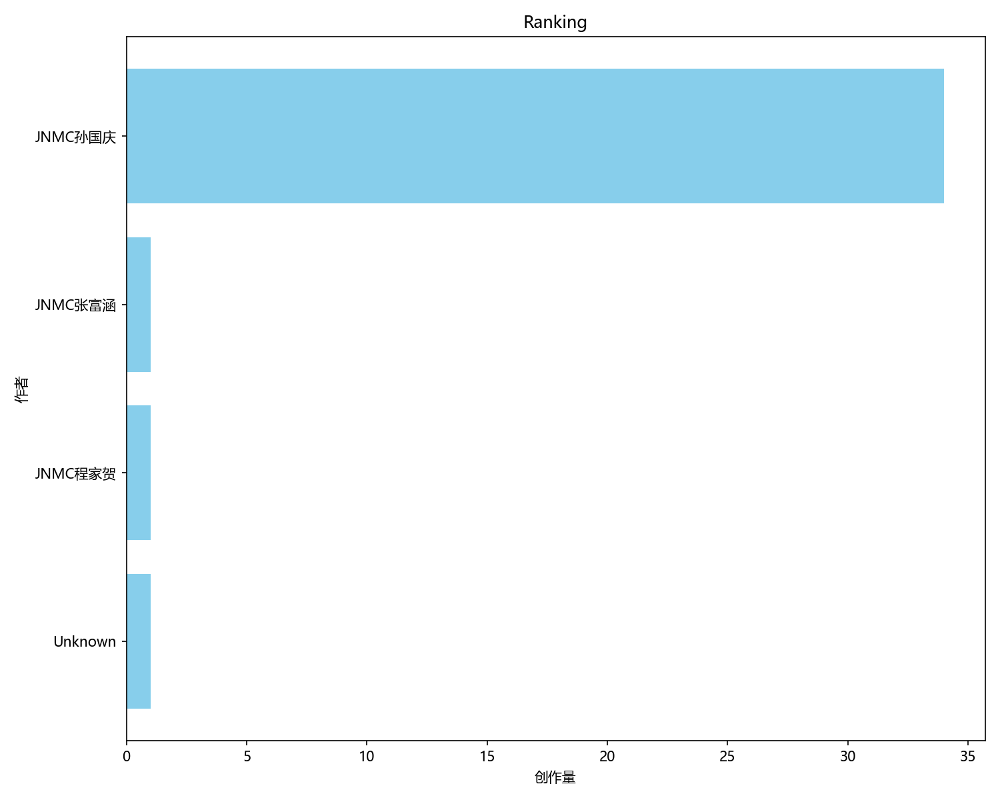

#  
# 算法训练平台

---

## 平台模块

> ### [基础理论学习](基础理论学习/README.md)
>
> 该模块包括基础理论的学习资源与讲解，帮助你掌握算法基础知识。

> ### [算法与代码学习](算法/README.md)
>
> 该模块为你提供了更为深入的算法与代码实现练习，帮助提升实际编程能力。

> ### [刷题训练](刷题模块/README.md)
>
> 这个模块专注于刷题，解决实际的编程问题，帮助你通过算法与数据结构的练习提升技能。

> ### [算法可视化](https://www.cs.usfca.edu/~galles/visualization/Algorithms.html)
>
> 该模块为你提供了算法可视化工具，帮助你更直观地理解算法的工作原理。
---

## 刷题训练数据

> **题目分布图**  
>   
> 此图展示了不同难度题目的分布情况。

> **题型分布图**  
>   
> 此图展示了题型的比例分布。

> **作者排名图**  
>   
> 此图展示了各个作者的排名情况。

---
