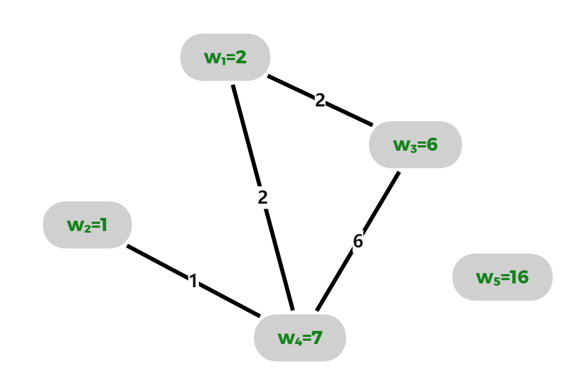

#### [备用返回通道](../../README.md)

题目描述：

牛客网有一个名为牛爱网神秘的入口。这天，牛可乐正在策划牛爱网的全新社交活动。每个人的账号在初始时都会被分配一个权重，第𝑖个账号的权重为𝑤𝑖。对于任意的两个账号𝑖和𝑗，如果它们的权重满足条件 `(𝑤𝑖 & 𝑤𝑗) ≧ 1`，即按位与运算结果大于或等于1，那么这两个账号会被分配到同一个社交网络中。

现有𝑛个账号，每个账号的权重已知，牛可乐希望知道，包含账号数量最多的社交网络中，包含多少个账号。

输入描述：
- 第一行输入一个整数𝑇，表示测试数据的组数。
- 对于每一组测试数据：
  - 第一行输入一个整数𝑛，表示账号的数量。
  - 第二行输入𝑛个整数𝑤1, 𝑤2, ..., 𝑤𝑛，表示每个账号的权重。

输出描述：
- 对于每组测试数据，输出包含账号数量最多的社交网络中，包含的账号数量。

限制：
- 1 ≤ 𝑇 ≤ 10^5
- 1 ≤ 𝑛 ≤ 10^5
- 1 ≤ 𝑤𝑖 ≤ 10^18
- 单个测试文件的𝑛之和不超过10^5

示例输入：
```
2
5
2 1 6 7 16
2
2 16
```

示例输出：
```
4
1
```

说明：
对于第一组测试数据，按位与运算的结果大于或等于1的账号形成社交网络，最大社交网络包含4个账号。
对于第二组测试数据，只有两个账号的按位与运算结果满足条件，因此最大的社交网络包含1个账号。


---

## 题解:
这个题目告诉我们题目的切入点以及思维方式的重要性.
比赛时间就那么长，我们应该选择尽可能优质的思维解题·
**这里建议重点看`优化思路`，以留下第一印象**
### 思路引导:
**首先先看数据规模，以确定解决方法**
我们可以看出,可以至少支持，我们的是算法应该是支持大约$O(n*log_2 n)$

#### `常规思路(正向思维)`

step1. **暴力枚举**：  
   在暴力枚举中，你通过逐一检查所有可能的二元关系来构建社区。例如，对于每一对元素 `<a, b>`，你会检查它们是否连通，并根据这个检查结果来合并它们。直接地 ， 我们想通过枚举每个账号，来计算存在的二元关系**S**，那时间复杂度将会达到$O( \frac{1}{2} *n*n*60)$ 显然行不通。

step2. **位运算的多元关系**：  
   而使用位运算时，你实际上在 **高效地利用位的表示特性** 来优化这些二元关系**S**，从而生成多元关系**E = S * S * ...**。例如，你通过对比各个比特位的值来确定多个元素是否属于同一社区，位运算将这个推导过程优化掉了。过程中用并查集维护就可以得到结果。时间复杂度大约是$O( n * 60*α(n))$，是能通过的。

#### `优化思路(逆向思维)`
- 我们一开始就面向着结果逆向推导:
  - 我们要找到这个最大的社区：
    - 我们怎么样构造这个社区?
      - 整体的社区又可能是由每bit位上的子社区合并来的。
      - 我们只需枚举某个社区有谁，合并就可以。
    - 多个社区可能有重复怎么办?
      - 两个社区间有重复就意味着联通，也就是要合并。如果用并查集会自动合并。
    - 我们在过程中记录所有社区集合的size的最大值就可以