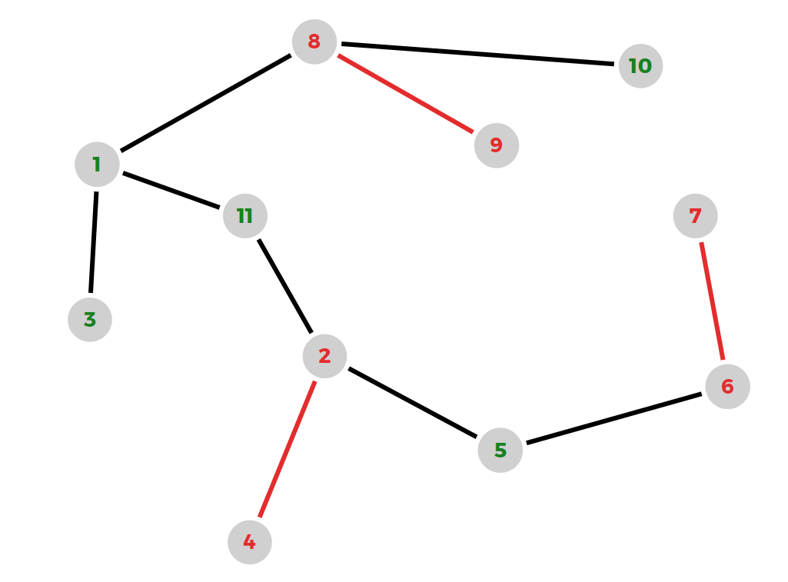

#### [备用返回通道](../../README.md)
# [转到题目](https://ac.nowcoder.com/acm/contest/100671/E)

---

### 题目描述

对于给定的由 `n` 个节点组成的无根树，每一条边都可以被染上颜色，初始时，全部边均为白色。

现在，选中树上 `k` 个不同的点，并将它们标记，随后，定义，如果一条树边 `(u, v)` 满足节点 `u` 和 `v` 同时被标记，那么这条树边自动被染为红色，不需要花费任何代价。

现在，你可以额外选择一些树边，将它们染成红色，每染一条边需要花费 1 点代价。

请你计算最小的染色代价，使得任意一个被标记的点都可以通过被染成红色的边到达至少一个未被标记的点。并输出不同的染色方案数量。

### 输入描述
- 第一行输入两个整数 `n`, `k` `(2 ≤ n ≤ 10^5; 1 ≤ k < n)`，代表树的节点数和被标记的点数。
- 第二行输入 `k` 个不同的整数 `a1, a2, ..., ak` `(1 ≤ ai ≤ n)`，代表被标记的点的编号。
- 接下来 `n - 1` 行，每行输入两个整数 `ui, vi` `(1 ≤ ui, vi ≤ n, ui ≠ vi)`，代表第 `i` 条树边连接 `ui` 和 `vi`。

### 输出描述
输出一行包含两个整数，分别表示最小的染色代价和满足条件的染色方案数量。由于染色方案数量可能很大，请输出对 `10^9 + 7` 取模后的结果。

### 示例1

#### 输入
```
11 6
8 2 4 7 9 6
8 10
8 9
1 8
1 11
1 3
11 2
5 6
2 5
4 2
7 6
```

#### 输出
```
3 4
```

#### 说明
在这个样例中，树的形态如下图所示。


---


## 解题思路