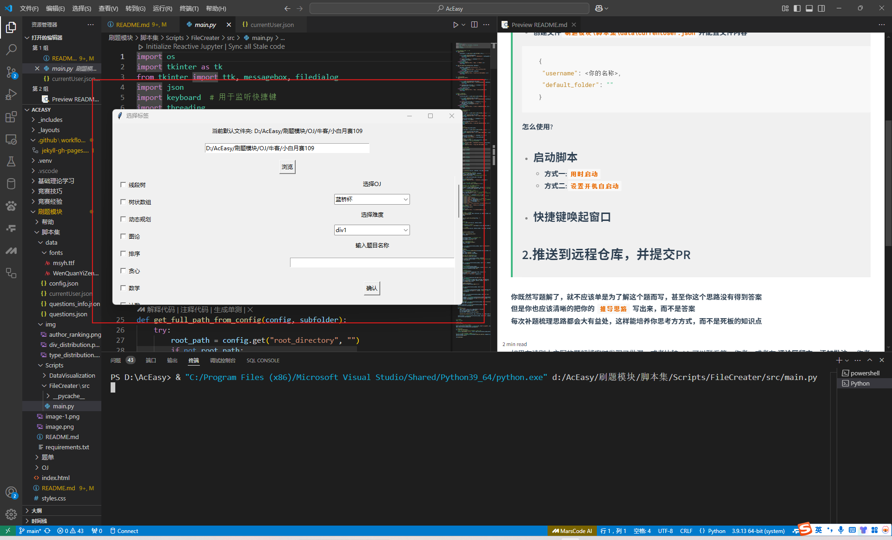
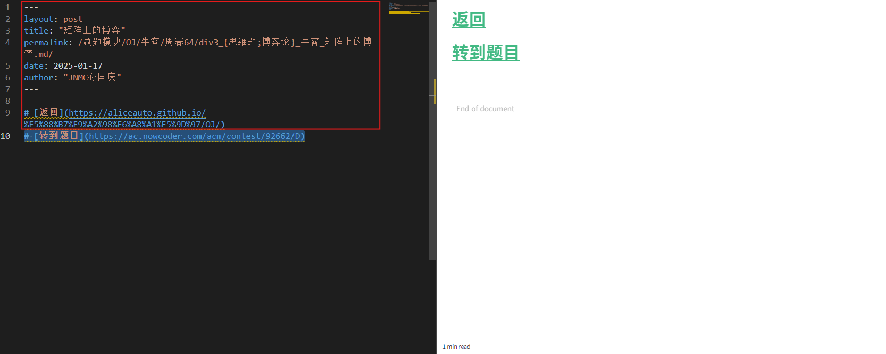

# [退回](https://aliceauto.github.io/)
# 周赛
> #### [如何提交?](帮助/README.md)
> #### [补题模块](OJ/README.md)
>
> ## 1.利用脚本创建 **题解`(.md)`**.
> **脚本的项目路径:`刷题模块\脚本集\Scripts\FileCreater\src\main.py`**
> **配置个人信息:**
> - **创建文件`刷题模块\脚本集\data\currentUser.json`并配置文件内容**
> ```json
>   {
>    "username": <你的名称>,
>    "default_folder": ""
>   }
> ```
> **怎么使用?**
> - ### 启动脚本
>   - **方式一:`用的时候启动`**
>       直接运行脚本
>   - **方式二:`设置开机自启动`**
>       - Windows 搜索'任务计划程序'，将'FileCrearer'中的脚本设置为自启动
> - ### 快捷键唤起窗口(ctrl +d)
>   
> - ### 在正文部分用markdown语言书写博客
> 
> 红色区域为固定，自动生成，谨慎修改.
> ## 2.推送到远程仓库，并提交PR
>  ---


**你既然写题解了，就不应该单是为了解这个题而写，甚至你这个思路没有得到答案**
**但是你也应该清晰的把你的 `推导思路` 写出来，而不是答案**
**每次补题梳理思路都会大有益处，这样能培养你思考方方式，而不是死板的知识点**

**tips:**
如果在读别人主写的题解博客时发现了纰漏，或者比较 __shi__ ,可以联系第一作者，或者在 __评论区留言、添加批注__ ，作者会及时修改。


**由各位创作的所有博客,将会最终成为将来的`复习`或我们网站项目`教育资源`，因此希望大家提供高质量博客**

---
# 题单
> # [蓝桥杯真题](蓝桥杯备赛/READMD.md)
> # [牛客算法入门题单](https://ac.nowcoder.com/discuss/817596)

