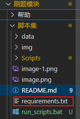

---

## **项目名称**

Python 脚本，用于分析 Markdown 文件并生成统计图表。支持中文字体配置和定时刷新功能。

---

## **功能**
- 可视化创建博客文件。(markdown)
- 扫描文件夹中的 `.md` 文件，统计 `div1` 到 `div5` 和类型分布。
- 生成柱状图展示统计结果。
- 支持一次性生成数据图，或定时刷新。

---

## **环境要求**

- Python 3.x
  - 安装 `matplotlib`、`keyboard`与 `watchdog`库

---

 ## **安装依赖**

运行以下命令安装依赖：
- ###  方式一:
```shell
pip install -r requirements.txt
```
`requirements.txt`文件在这里

- ### 方式二:
或者单独安装 `matplotlib`、`keyboard`与 `watchdog`：

```shell
pip install matplotlib watchdog keyboard
```
`注意:记得配置python的环境变量，不太明白的使用` **`豆包MarsCode`(web)端工作区** `直接装python拓展插件即可`
---


---

