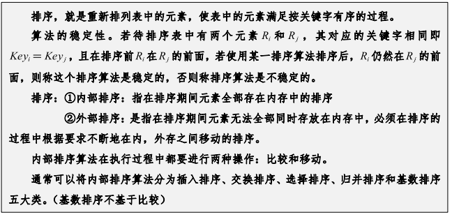
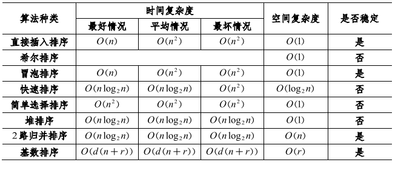

# [退回](../README.md)
# 排序

## 排序的概念
> 

## 排序的分类
> 1. **内部排序算法**（数据可完全加载入内存，所有操作在内存中进行）
>    - **就地排序算法**（In-place Sorting）：这些算法只需要少量的额外内存（如 O(1) 或 O(log n)）来进行排序。
>      - **快速排序**（Quick Sort）：时间复杂度$ O(n log n)$，空间复杂度 $O(log n)$。
>      - **堆排序**（Heap Sort）：时间复杂度$ O(n log n)$，空间复杂度 $O(1)$。
>      - **插入排序**（Insertion Sort）：时间复杂度 $O(n^2)$，空间复杂度 $O(1)$。
>      - **选择排序**（Selection Sort）：时间复杂度 $O(n^2)$，空间复杂度 $O(1)$。
>      - **冒泡排序**（Bubble Sort）：时间复杂度 $O(n^2)$，空间复杂度 $O(1)$。
>   
>    - **非就地排序算法**（Non-in-place Sorting）：这些算法需要额外的存储空间来辅助排序，通常是 O(n) 空间。
>      - **归并排序**（Merge Sort）：时间复杂度$O(n log n)$，空间复杂度 $O(n)$。
>      - **基数排序**（Radix Sort）：时间复杂度$O(nk)$，空间复杂度 $O(n + k)$，其中 k 是数字的位数。
>      - **计数排序**（Counting Sort）：时间复杂度 $O(n + k)$，空间复杂度 $O(n + k)$。
> 2. **外部排序算法**（数据集过大，无法全部加载入内存，必须依赖外部存储）
> 
>    *外部排序算法通常用于需要处理非常大规模数据集的场景，例如数据库管理系统中的排序操作。常见的外部排序算法是**归并排序**（Merge Sort），通常采用**归并排序的外部实现**来处理大规模数据。*
>    - **外部归并排序**（External Merge Sort）：这种排序方法将数据划分为多个块，每个块先用内部排序算法排序，然后将排序后的块通过归并算法合并。
>    - **替代合并排序**（Replacement Selection）：在进行归并操作时，使用一种特殊的选择方式减少磁盘访问次数。

## 排序算法
> - 冒泡排序
> - 插入排序
> - 选择排序
> - 希尔排序
> - 归并排序
> - 快速排序
> - 堆排序
> - 计数排序
> - 桶排序
> - 基数排序

> 
