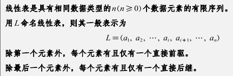
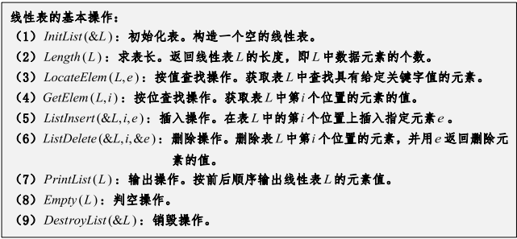
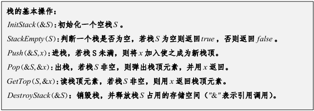
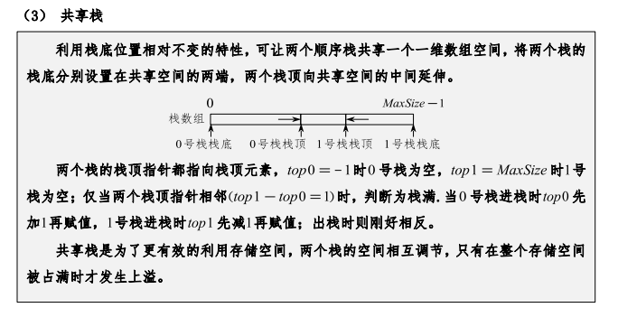
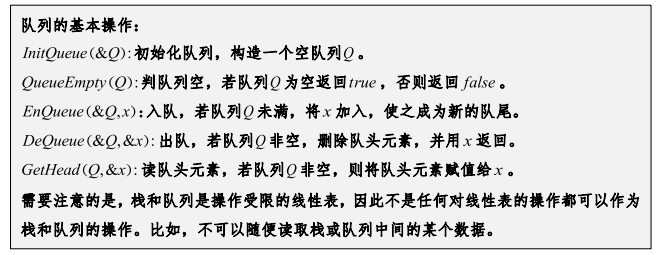
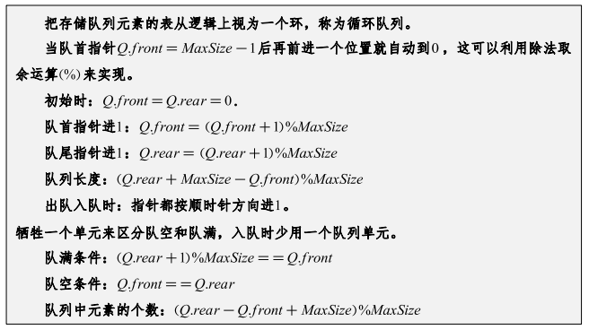
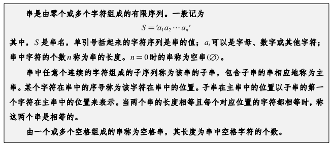
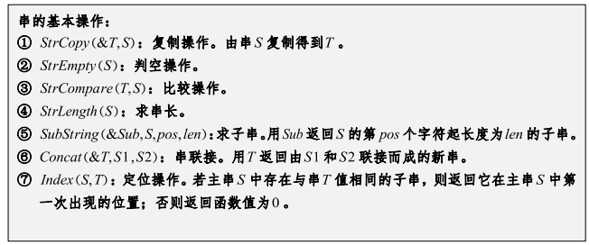

> # 线性结构
>
> ## 线性表
>
> ### 线性表的定义
> 
>
> ### 线性表的基本操作
> 
>
> ### 线性表的实现
> 
>
> ---

> ## 栈与队列
>
> ### 栈
>
> #### 栈的定义
> **栈是一种操作受限的线性表**
>
> ##### 栈的操作
> 
>
> ##### 栈的实现
> - 顺序栈
>   - 普通顺序栈
>   - 共享栈
>      
> - 链式栈
>
> ### 队列
>
> #### 队列的定义
> **队列是一种操作受限的线性表**
>
> ##### 队列的操作
> 
>
> ##### 队列的分类
> - 队列
> - 循环队列
>   
> - 双端队列
>
> ##### 队列的实现
> - 顺序队列
> - 链式队列
>
> ---

> ## 串
>
> ### 串的定义
> 
>
> ### 串的操作
> 
>
> #### 寻子串算法
> - 朴素算法
> - KMP算法
