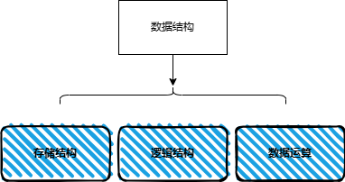
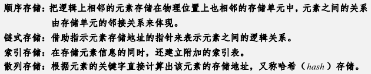
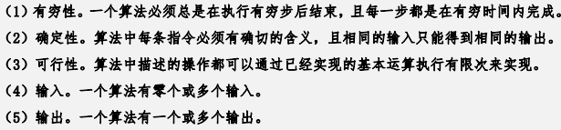

## 数据结构
### 数据结构定义

#### 形式定义
**Data_Structure = `(D,S)`**
- `D`：数据元素的 `有限集合`
- `S`：数据结构的操作的 `有限集合集合`

#### 构成

##### 逻辑结构

##### 存储结构

---
## 算法

#### 算法的特性

- 有穷性
- 确定性
- 输入
- 输出
- 可行性

#### 算法复杂度的运算性质
- 加法规则：`O(f(n)+g(n))=max(O(f(n)),O(g(n)))`
- 乘法规则：`O(f(n)*g(n))=O(f(n))*O(g(n))`
