# 非线性结构

## 矩阵
### 矩阵的压缩存储
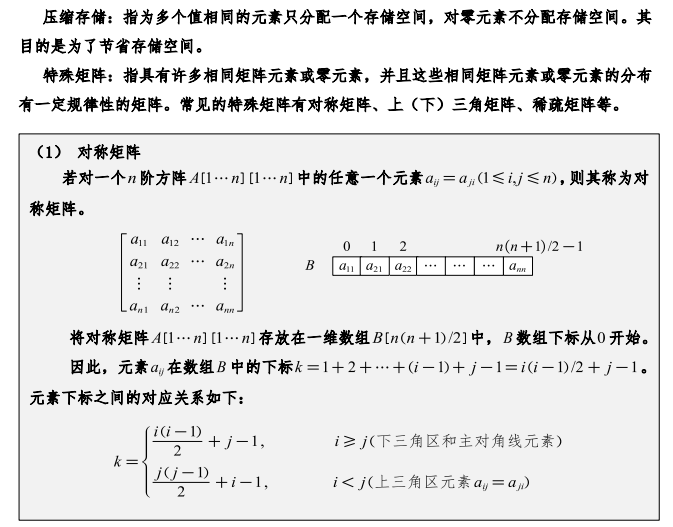
- 对称矩阵
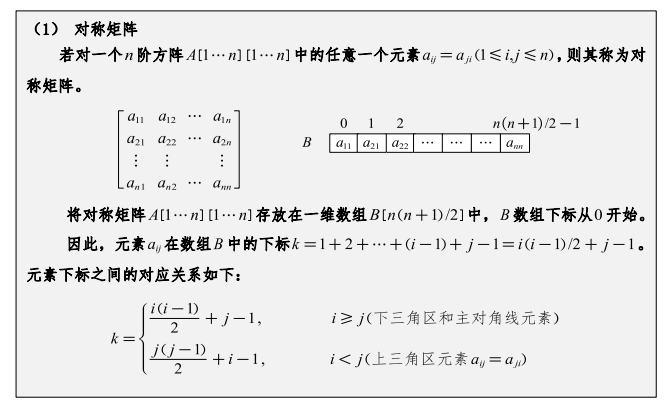
- 三角矩阵
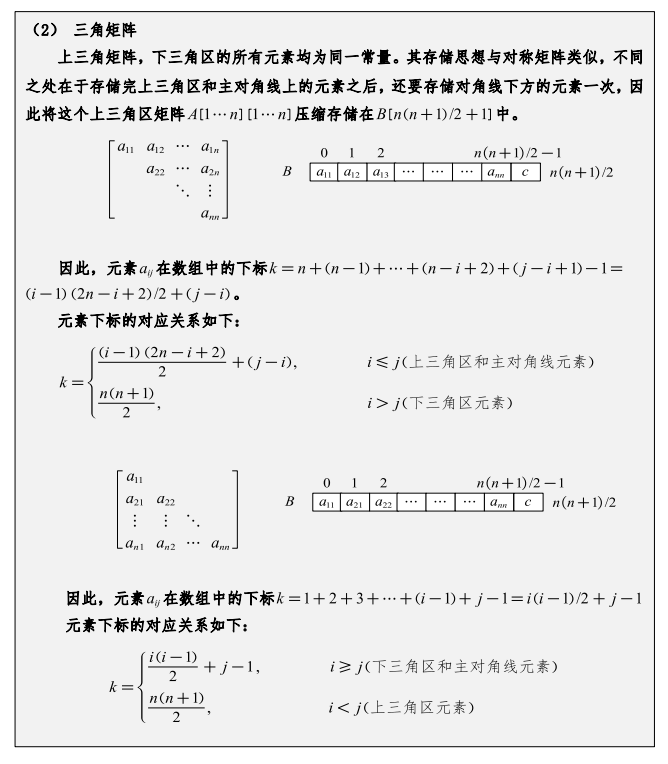
- 稀疏矩阵
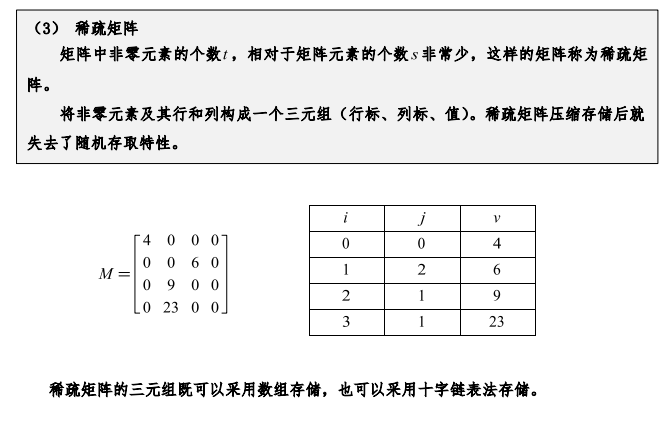

---
## 树

### 树的概念
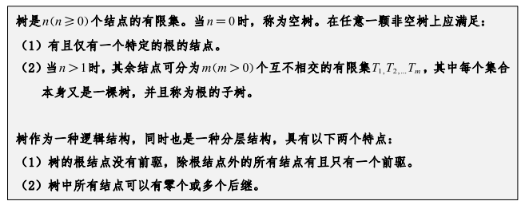

### 树的术语
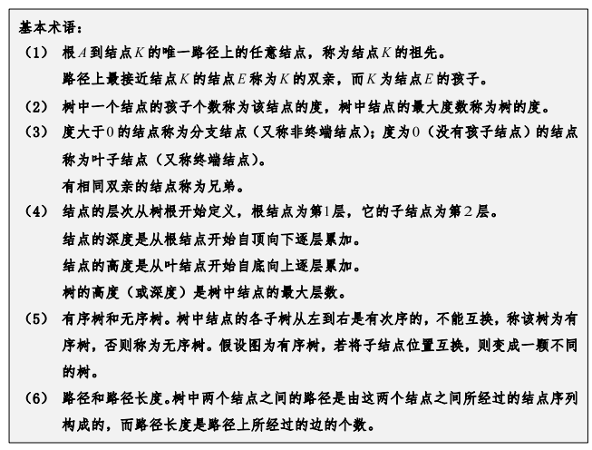

### 树的性质
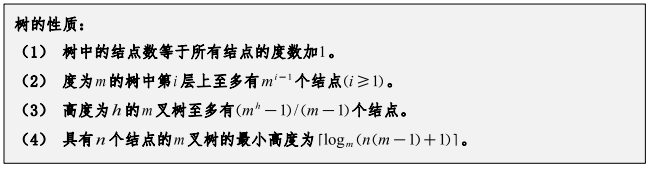

### 树的遍历方式
- 先根遍历`(DFS)`
- 后根遍历`(DFS)`

### 二叉树

#### 二叉树的定义

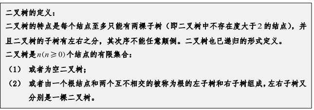

#### 特殊二叉树

- 完全二叉树
- 满二叉树
- 平衡二叉树

#### 二叉树应用

- 二叉搜索树/二叉排序树（BST）
  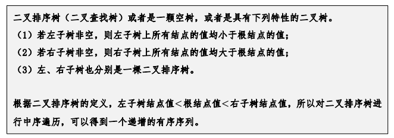
- 哈夫曼树
  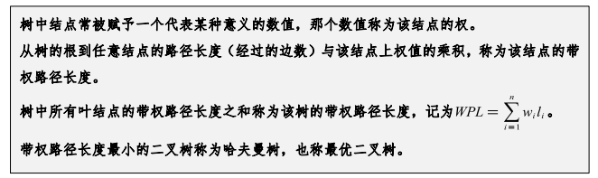
- 堆
#### 二叉树的性质

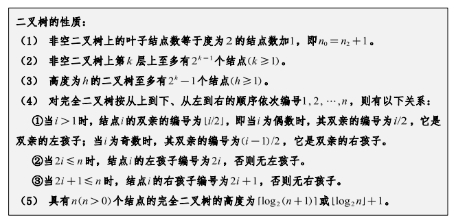

#### 二叉树的存储

- 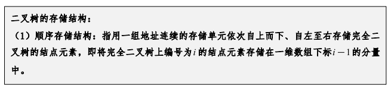
- 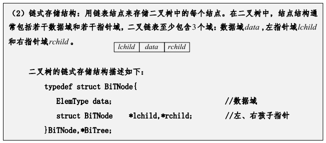
  
#### 二叉树的遍历

- 前序遍历`(DFS)`
- 中序遍历`(DFS)`
- 后序遍历`(DFS)`
- 层序遍历`(BFS)`

## 森林
### 森林的定义
- **森林**是指由多个互不相交的树组成的集合。
### 将树、森林转换为二叉树

### 森林的遍历
- 先序遍历`(DFS)`
- 中序遍历`(DFS)`
---
## 图
### 图的概念
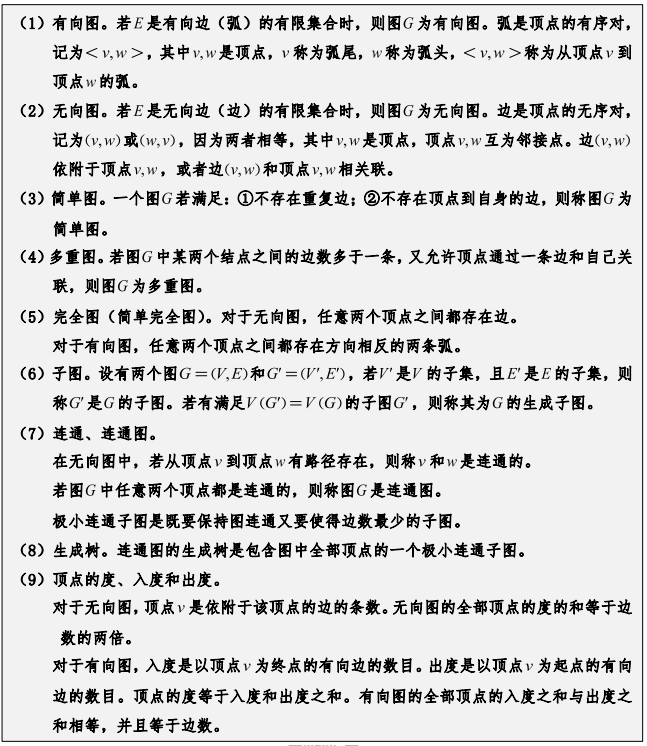
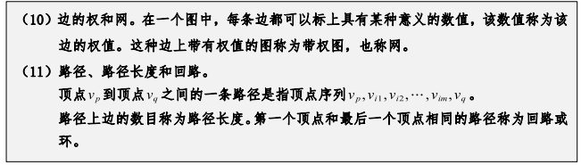
### 图的存储
- 邻接矩阵
  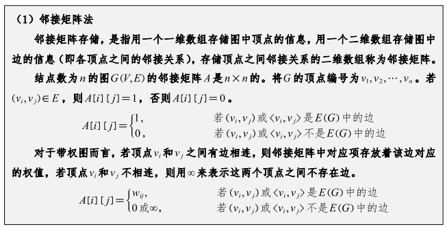
  - 特点
    - 无向图的邻接矩阵是对称矩阵
    - 稀疏图的邻接矩阵很稀疏
    - 稠密图的邻接矩阵很密集
    - 对应无向图的度矩阵，每个元素的值为度数
    - 对应有向图的入度矩阵，每个元素的值为入度
    - 对应有向图的出度矩阵，每个元素的值为出度
- 邻接表
  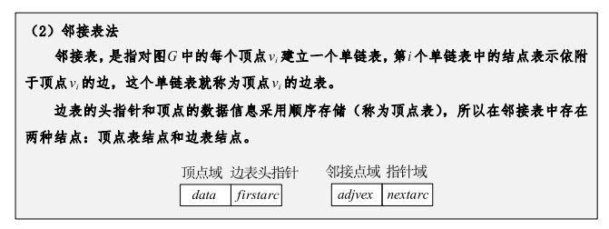
  - 特点
    - 无向图的存储空间为$O(|V| + 2|E|)$
    - 有向图的存储空间为$O(|V|+|E|)$
    - 稀疏图邻接表极大减少了存储空间
    - 图的邻接表不唯一
    - 
- 十字链表
- 邻接多重列表

### 图的遍历
- 深度优先搜索`(DFS)`
- 广度优先搜索`(BFS)`

### 图的应用

#### 最小生成树
##### 最小生成树的性质
- 无向图的最小生成树是唯一的
- 有向图的最小生成树是唯一的，但不一定是最小权值的
- 最小生成树的权值是树中边的权值的最小值
- 最小生成树的权值是唯一的
- 最小生成树的边数等于顶点数减一
##### 最小生成树的算法
- Prim算法
  
- Kruskal算法
  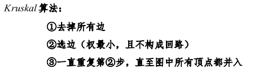
#### 最短路径
##### 最短路径的概念
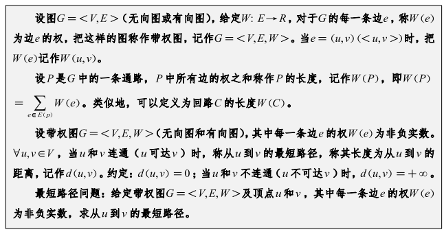

#### 拓扑排序
##### 拓扑排序的概念
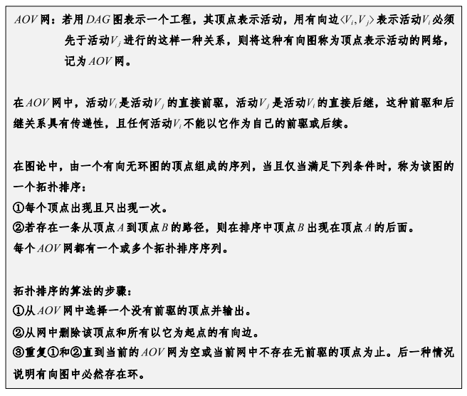
#### 关键路径
##### 关键路径的概念
