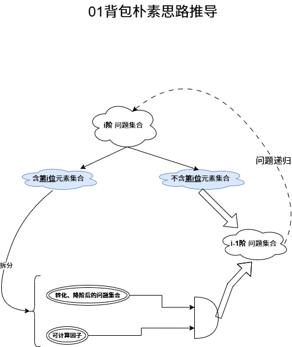
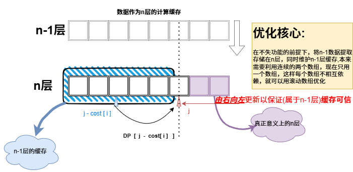

># 01背包模型
>## 思维模型:
> 
>从n个物品中选几个带走，不超重的情况下最多带走多贵的物品
>**`精髓是:`将集合划分使得：**
>- **明确`(i,j)` 条件，以定位集合元素`F(i,j)`**
>- **明确元素`F(i,j)`的属性**
>- 构造 **`子集们`与`自身全集`可转移**
>#### 推导思路:
>
>
>#### 优化思路:
>
---
# 完全背包
## 思维模型:

从n种物品仓库中带走物品，不超重的情况下最多带走多贵的物品
---
# 多重背包
## 思维模型:

---
# 分组背包
## 思维模型:
---