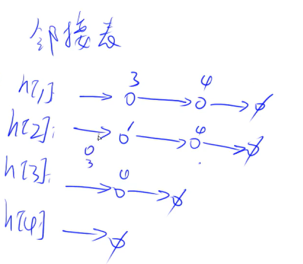

# 图
数是无环联通图  
无向图是一种特殊的有向图，所以只需考虑有向图的存储方式即可  

## 有向图的存储方式
1. 邻接矩阵:g[a][b]存储a到b的这条边的信息，如果有权重 g[a][b]就是权重，没有就是bool值 O(n^2)
2. 邻接表(用的最多):每个节点开一个链表(拉链法hash)  

## 模板

```C++
// 对于每个点k，开一个单链表，存储k所有可以走到的点。h[k]存储这个单链表的头结点
const int N = 1e5 + 10, M = 2 * N;
int h[N], e[N], ne[N], idx;
//e[N]存储节点的值 ne[N]存储下一个节点的下标 idx存储当前的下标
// 添加一条边a->b
void add(int a, int b)
{
    e[idx] = b;
    ne[idx] = h[a], h[a] = idx;
    idx++;
}

// 初始化
idx = 0;
memset(h, -1, sizeof h);
```

## 拓扑排序
1. 拓扑排序是针对有向无环图（DAG）的排序，即有向无环图中的节点可以按照先后顺序进行排序，使得每一条有向边从排在前面的节点指向排在后面的节点。
2. 有向无环图被称为拓扑图
3. 拓扑排序的算法步骤如下：
   1. 构建邻接表和入度数组。
   2. 将所有入度为0的节点加入队列。
   3. 依次从队列中取出节点，将其加入拓扑排序结果中，并将其所有邻接节点的入度减1。
   4. 如果某个邻接节点的入度减为0，则将其加入队列。
   5. 重复步骤3和4，直到队列为空。
   6. 如果拓扑排序结果中的节点数等于图中的节点数，则拓扑排序成功；否则，图中有环，无法进行拓扑排序。

```C++
// 拓扑排序
int n, m;
int h[N], e[N], ne[N], idx;
int d[N]; // 存储每个点的入度
int q[N], hh, tt;
void add(int a, int b)
{
    e[idx] = b, ne[idx] = h[a], h[a] = idx ++ ;
}
int topsort()
{
    int cnt = 0;
    hh = 0, tt = -1;
    for (int i = 1; i <= n; i ++ )
        if (!d[i])
            q[++ tt] = i;
    while (hh <= tt)
    {
        int t = q[hh ++ ];
        for (int i = h[t]; ~i; i = ne[i])
        {
            int j = e[i];
            if (-- d[j] == 0)
                q[++ tt] = j;
        }
    }
    if (tt == n - 1)
        return 1;
    return 0;
}
```
