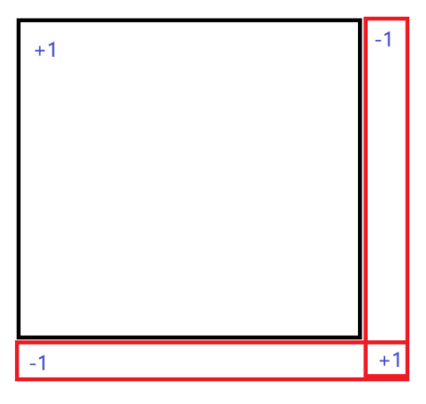

差分（Difference Array）本质上就是研究元素间差值的算法，它的核心思想是：

通过记录相邻元素之间的变化量，而不是直接修改原始数组，从而高效地实现区间操作。在数学上体现为**研究导数的性质**

换句话说，差分的关键点就是在数组的某个位置 "标记变化"，然后通过累积这些变化来恢复最终的数组。或者直接在变化上研究问题。
**因为数组是均匀且连续的，每个diff[i] 都可以看成$\frac{\mathrm{d}y}{\mathrm{d}x} = \frac{\text{diff}[i]}{1}$
因此差分可以看做成“导数”**
这样差分就和数学联系起来了，转化为数学问题

# 二维差分

# 二维前缀和

**两种方式**:

- 前缀和公式 ✅ 

\[
\text{sum}[i][j] = \text{sum}[i-1][j] + \text{sum}[i][j-1] - \text{sum}[i-1][j-1] + a[i][j]
\]
- 行列分离恢复✅

    1. **按行前缀和：**

    \[
    \text{row\_prefix}[i][j] = \sum_{k=1}^{j} diff[i][k]
    \]

    2. **按列前缀和：**

    \[
    ord[i][j] = \sum_{k=1}^{i} \text{row\_prefix}[k][j]
    \]

---

